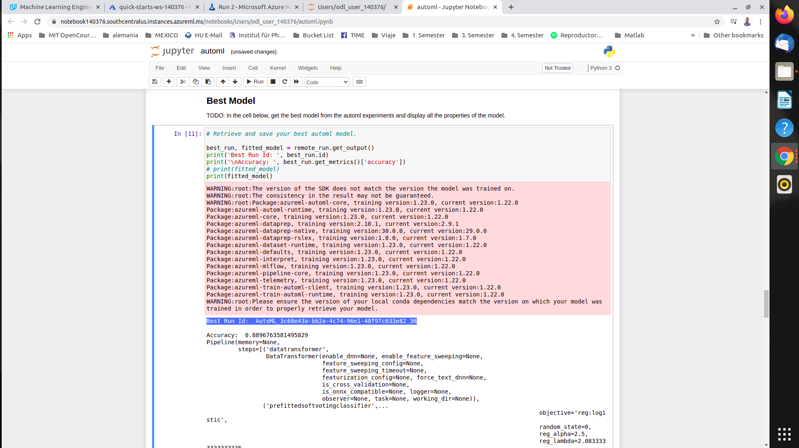
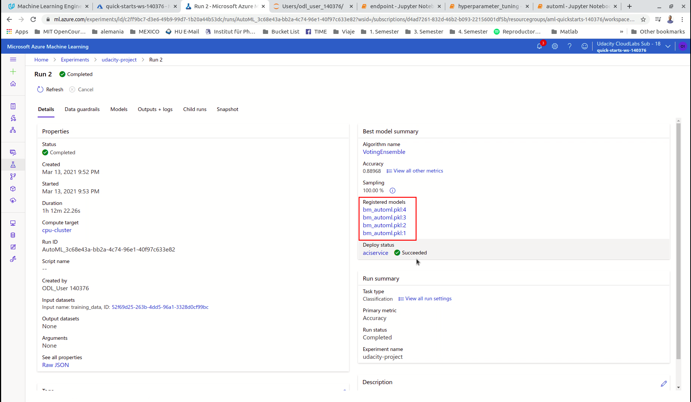
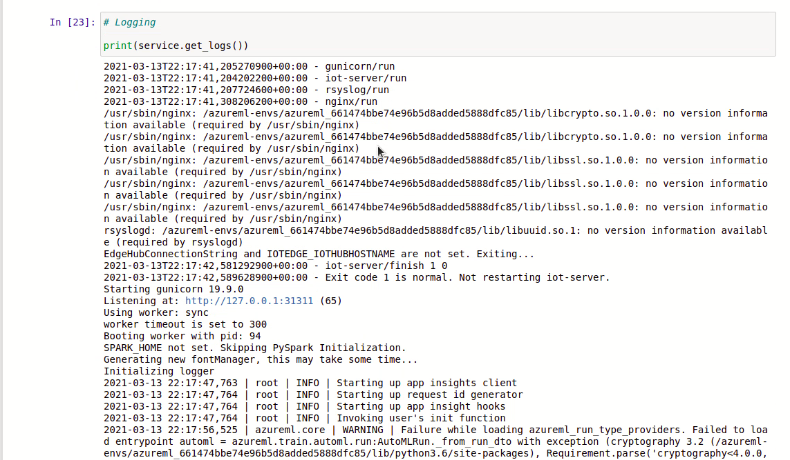

# Loan Default Prediction

This is the **Capstone Project** from Udacity's *Machine Learning Engineer with Microsoft Azure Nanodegree* and its objective is to apply the acquired knowledge to build a ML model and deploy it using an external dataset (i.e. not included in the Azure environment) and in that way emulate a somewhat more realistic scenario.

We will be using the **LendingClub** dataset for borrower failure risk analysis, that is, analysing the factors that contribute to increase or decrease the danger that a *loaner* may default on repaying a loan to the *lender*. The overall goal is to learn how real world problems can be solved, particularly in the context of risk analytics in banking and financial services, using Machine Learning.

## Project Set Up and Installation

### Prerequisites
To be able to follow along this project on remote compute resources the following steps are needed:

1. Log into your Azure account
2. Create a Workspace
3. Acces the ML Studio
4. Clone or download the notebooks and scripts from this repo: `hyperparameter_tuning.ipynb`, `automl.ipynb`, `train.py` and `endpoint.py`, and upload them to your working folder in the Studio
5. Download the **LendingClub** dataset from Kaggle [here](https://www.kaggle.com/wordsforthewise/lending-club) and upload it to the Studio
6. [OPTIONAL] Create a folder called "Data" and move the dataset there. The notebooks access the data from this folder, if there is no "Data" folder the code in the notebooks and the `train.py` script will have to be changed to the path where the dataset is
7. Create a compute instance to run the notebooks
8. Open the jupyter notebooks and run the cells 

### Project Overview
We will train and optimize an Azure ML pipeline using two different methods: **Hyperparameter Tuning using Azure's Hyperdrive** and **Auto Machine Learning**. For the Hyperdrive run, a simple ligistic regression model was chosen. The best model from both approaches is then deployed to be interacted with.

Below is an overview of the workflow

<p align="center">
  
</p>

<p align="center" style="font-size:10px">
  <b>Project's Workflow. From Udacity's "Machine Learning Engineer with Microsoft Azure Nanodegree".</b>
</p>

## Dataset

### Overview

In this project, the *lending club* dataset from the LendingClub American peer-to-peer lending company was used. The purpose is to use data for risk analytics and minimization in a banking and financial context. To achieve that, statistical information about past loan applicants is used to build a model using supervised learning, where the labels are whether or not the applicant failed to fully repay the loan, to be able to predict if a new applicant is likely to repay the loan. The aim is for the model to identify patterns in the dataset that can be used to determine the outcome of the new application based on the financial history of the applicant. In this way, the probability of defaulting the loan can be assessed and lenders can make an informed decision accordingly that may reduce the loss of business for the company by cutting down the credit loss, e.g. by denying the loan, raising interest rates, offering a different loan amount, etc.

Below is a table with all the information available in the dataset for training the model.
        
   |      LoanStatNew     | Description                                                                                               |
   |:--------------------:|:--------------------------------------------------------------------------------------------------------------------------------------------------------------------------------------------------------:|
   | loan_amnt            | The listed amount of the loan applied for by the borrower. If at some point in time, the credit department reduces the loan amount, then it will be reflected in this value. |
   | term                 | The number of payments on the loan. Values are in months and can be either 36 or 60.  |
   | int_rate             | Interest Rate on the loan                                                                                                                                                                                |
   | installment          | The monthly payment owed by the borrower if the loan originates.                                                                                                                                         |
   | grade                | LC assigned loan grade                                                                                                                                                                                   |
   | sub_grade            | LC assigned loan subgrade                                                                                                                                                                                |
   | emp_title            | The job title supplied by the Borrower when applying for the loan.*                                                                                                                                      |
   | emp_length           | Employment length in years. Possible values are between 0 and 10 where 0 means less than one year and 10 means ten or more years.                                                                        |
   | home_ownership       | The home ownership status provided by the borrower during registration or obtained from the credit report. Our values are: RENT, OWN, MORTGAGE, OTHER                                                    |
   | annual_inc           | The self-reported annual income provided by the borrower during registration.                                                                                                                            |
   | verification_status  | Indicates if income was verified by LC, not verified, or if the income source was verified                                                                                                               |
   | issue_d              | The month which the loan was funded                                                                                                                                                                      |
   | loan_status          | Current status of the loan                                                                                                                                                                               |
   | purpose              | A category provided by the borrower for the loan request.                                                                                                                                                |
   | title                | The loan title provided by the borrower                                                                                                                                                                  |
   | zip_code             | The first 3 numbers of the zip code provided by the borrower in the loan application.                                                                                                                    |
   | addr_state           | The state provided by the borrower in the loan application                                                                                                                                               |
   | dti                  | A ratio calculated using the borrower’s total monthly debt payments on the total debt obligations, excluding mortgage and the requested LC loan, divided by the borrower’s self-reported monthly income. |
   | earliest_cr_line     | The month the borrower's earliest reported credit line was opened                                                                                                                                        |
   | open_acc             | The number of open credit lines in the borrower's credit file.                                                                                                                                           |
   | pub_rec              | Number of derogatory public records                                                                                                                                                                      |
   | revol_bal            | Total credit revolving balance                                                                                                                                                                           |
   | revol_util           | Revolving line utilization rate, or the amount of credit the borrower is using relative to all available revolving credit.                                                                               |
   | total_acc            | The total number of credit lines currently in the borrower's credit file                                                                                                                                 |
   | initial_list_status  | The initial listing status of the loan. Possible values are – W, F                                                                                                                                       |
   | application_type     | Indicates whether the loan is an individual application or a joint application with two co-borrowers                                                                                                     |
   | mort_acc             | Number of mortgage accounts.                                                                                                                                                                             |
   | pub_rec_bankruptcies | Number of public record bankruptcies   |

### Task
The task at hand is a classification task, that is, to train an accurate model using a logistic regression algorithm to predict a discrete class label output defining if the loan will result in default or not. The common metric to consider for this kind of task is `Accuracy`.

At the same time, we'll gain an insight into the most important features that determine the result yielded by the model. This allows the company to understand which variables are strong indicators of loan default and apply this knowledge in future risk assessment.

### Access
The dataset can be found and downloaded from Kaggle [here](https://www.kaggle.com/wordsforthewise/lending-club). It was then uploaded to the work folder and accessed locally.

```python
df = pd.read_csv('./Data/lending_club_loan.csv')
```

## Automated ML

Azure's `automl` is a very helpful tool to effectively and automatically, albeit slow, sweep through various different models with different parameters. It has a high probability to find a good model according to a predefined metric because it is not restricted to just one model, at the cost of a longer training time. 

### AutoML Configuration

We define first the settings and cofiguration needed for the auto machine learning run:

`enable_early_stopping` : this parameter allows for the run to be stopped if the model's score has not benn iteratively improving

`max_concurrent_iterations`: the maximum number of iterations allowed to be executed parallelly

`max_cores_per_iteration`: cores from compute that are to be used per each iteration during training

`verbosity` : amount of information included in the training logs

`compute_traget` : compute to be used for training

`experiment_timeout_minutes` : defines how long the experiment can be run, if too low the experiment might not run, if too high experiment time out failures may occur and lead to unnecessary expenses

`task` : type of experiment, in this case, classification

`primary_metric` : main metric for the model to look at during training

`training_data` : data to use for training the model

`label_column_name` : name of column containing the labels for supervised training

`n_cross_validations` : number of cross validations to perform after the normal training run. Useful if no validation set is provided, the metrics' values are averaged over different sets of values


### Results

With the above configuration the AutoML run took a little over an hour.

Below is a screenshot showing the `RunDetails` widget showing that the automl run is done as well as some of the different experiments:


The run yielded a `VotingEnsemble` as the best model with the highest `Accuracy = 0.8897`.

A voting ensemble is a machine learning model that builds predictions from combining results from other models, it is therefore sometimes refered to as a meta-model. More specifically, Azure AutoML uses the `PreFittedVotingClassifier` Class, inherited from sklearn ensemble `VotingClassifier` class, which mixes different classifiers and uses a majority vote or the average predicted probabilities to predict the class labels. It is very helpful to balance out the individual performances of the models.

Here is a screenshot of the best model:



In order to improve the results from the `automl` run we could try allowing deep learning methods in the batch of models to try during the execution of the experiment. Optimizing other steps of the workflow might also influence the end results in a positive way such as getting a larger dataset thorough e.g. resampling techniques or expanding the feature space with a more thorough EDA step of feature engineering.

## Hyperparameter Tuning

In this experiment, a **Logistic Regression** model is trained using supervised learning for prediction purposes. A logistic regression is an appropiate model to use for conducting prediction for the value of a dichotomous (binary) variable.

The `Hyperdrive` run sweeps different hyperparameters combinations to find the values that optimize the model's main metric. Two hyperparameters are used for the sampling: `inverse of regularization strength "C"` and `maximum number of iterations`.

Regularization is used to prevent the model from overfitting when many features are present but not too much data is available. Large parameter values are penalyzed lest the model almost perfectly fits the training data and deters generalization. A larger value of the regularization strength for a given parameter reduces the probability of the parameter's value to increase as an adjusting response for small perturbations in the data. In this case, since it is the inverse of the regularization strength, the values for this parameter need to be small and are sampled from an uniform distribution between 0.01 to 1.

The second hyperparameter, maximum number of iterations, is the number of iterations that are allowed for the model to converge, in this case when the accuracy is at its maximum value, given a set of parameters. This hyperparameter is used to prevent the model to overfit and/or run without converging and it can be equal to one of the following 4 values: `choice(100,200,500,1000)`.

### Results

A screenshot of the `RunDetails` widget shows the run finished successfully and provides an overview as well of the first top five child runs:


The `Hyperdirve`'s best run yielded an `Accuracy = 0.8367` for the logistic regression model with `Hyperparameters`: `inverse of regularization strength C = 0.5930` and `maximum number of iterations = 200`.


To get better results, we could try two approaches:

The `Hyperdrive` trains a single model, this could hinder the experiment from yielding optimal results if the chosen model is not ideal. Trying out different models and not just different parameters could help improve the experiment's results. Alternatively, using a more exhaustive approach such as Grid sampling could lead to better hyperparameter values. 

## Model Comparison

|     |      AutoML    | Hyperdrive       |
|:--------------------:|:-----------------------------:|:-----------------------------:|
| Model | `VotingEnsemble` | `Logistic Regression`  |
| Accuracy | `0.8897` | `0.8367`  |

From the two training strategies, the model with the best performance was the `VotingEnsemble` with the highest `Accuracy = 0.8897` from the `automl` run, so this is the model that we'll deploy to a **Azure Container Instance (ACI)**, this type of instance is used for workloads under 48Gb of memory.

## Model Deployment

To be able to consume the model, it needs to be deployed. Before the actual deployment, some preprocessing steps need to be carried out.

We first save the model that we have selected and then register it.



After registration, we need to define a custom environment to be used for depolyment. This is done using the `InferenceConfig` Class.

The two main parameters for the `InferenceConfig` object are:

 - `entry_script` : contains the script for model scoring, i.e., processes the input data and returns the scored output.
 - `environment` : contains the Python dependencies and variables used in the machine learning experiment, including data preparation, training, and deployment.
Both parameters can be retrieved from the `outputs` folder from the saved model, the `scoring.py` and `env.yml` files respectively. 

Afterwards we define the configuration for the deployment using the `deploy_configuration` method from the `AciWebservice` Class. Here we define parameters such as the hardware setup of the webservice `cpu_cores` and `memory_gb`; and other parameters like `auth_enabled` for authorization purposes and `enable_app_insights` for logging.

Finally, the deployment of the model to the **ACI** creates a REST endpoint and exposes it to allow interactions via a HTTP API service over POST requests.


To query the endpoint we use the `endpoint.py` script to feed JSON strings with the required information to be consumed by the deployed model. The image below shoes the cell of the `automl` notebook where two random data points from the dataset are transformed into JSON strings samples to test the deployed model:


By sending HTTP POST requests to the server's endpoint and the JSON payload, the model can make predictions and send them back as HTTP POST responses. This is carried out by executing the `endpoint.py` script:


For a clearer explanation of the whole execution please refer to the **Screen Recording** of the project.

## Screen Recording
*TODO* Provide a link to a screen recording of the project in action. Remember that the screencast should demonstrate:
- A working model
- Demo of the deployed  model
- Demo of a sample request sent to the endpoint and its response

## Standout Suggestions

Additionally, some extra services provided by the ML Studio were leveraged for a more integral understanding of the project:
 - `service.weblogs`: Which enables logging for the deployed webservice. It provides information on the web app such as listening port, scoring timer, time of request's arrival, etc.



 - **Model's explanation preview** : Allows to visually explore the data and the feature importance, i.e., how much of an influence each feature has on the outcome form the model's training. 


 - **Application Insights**: It's an alternative way for debugging and troubleshooting the web app by retrieving logs from the deployed model.


## Data Citation

## Resources


 - 
